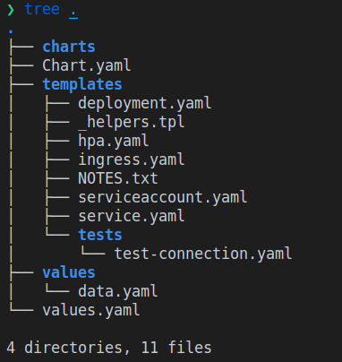

# helm-values

Helm plugin to manage multiple subcharts' values by env.

[](https://oclif.io)
[](https://npmjs.org/package/helm-values)
[](https://npmjs.org/package/helm-values)
[](https://github.com/hoongeun/helm-values/blob/master/package.json)

<!-- toc -->
* [helm-values](#helm-values)
* [Why I made this?](#why-i-made-this)
* [Usage](#usage)
* [Commands](#commands)
<!-- tocstop -->

# Why I made this?

There's already simmilar project [helm-values](https://github.com/shihyuho/helm-values). But it doesn't meet my needs.

My needs are

- Helm doesn't support the env patch feature like [kustomize](https://kustomize.io)
- I want to manage values.yaml by dividing in each subcharts
- The `values.yaml`, `values.json` are no more programmable

So I decided to make my own tools for these.

## How it works?

- init - Initiate the helm-values

  

- generate - A helper tools to generate multiple manifests or templates in single command

  

- build - This operation is a combination of combine, patch, merge

  - combine - Combine template([nunjucks](https://mozilla.github.io/nunjucks/), [ejs](https://ejs.co/)) with data model
    `/mysql/prod.yaml.njk + /mysql/data.yaml -> /mysql/prod.yaml`

    

  - patch - Patch `[stage].yaml` with `base.yaml` if it is avaiable
    `/mysql/base.yaml + /mysql/prod.yaml -> /mysql/values.yaml`

    

  - merge - Merge subcharts
    `/mysql/values.yaml + /redis/values.yaml -> /values.yaml`

    

- clean - A helper tools to clean the `values.yaml` and processed data

  


# Usage

<!-- usage -->
```sh-session
$ npm install -g helm-values
$ helm-values COMMAND
running command...
$ helm-values (-v|--version|version)
helm-values/0.1.0 linux-x64 node-v14.15.5
$ helm-values --help [COMMAND]
USAGE
  $ helm-values COMMAND
...
```
<!-- usagestop -->

# Commands

<!-- commands -->
* [`helm-values build`](#helm-values-build)
* [`helm-values clean [CHART]`](#helm-values-clean-chart)
* [`helm-values combine [CHART]`](#helm-values-combine-chart)
* [`helm-values generate [CHART]`](#helm-values-generate-chart)
* [`helm-values help [COMMAND]`](#helm-values-help-command)
* [`helm-values init`](#helm-values-init)
* [`helm-values merge [CHART]`](#helm-values-merge-chart)
* [`helm-values patch [CHART]`](#helm-values-patch-chart)

## `helm-values build`

```
USAGE
  $ helm-values build

OPTIONS
  -f, --format=(yaml|json)  [default: yaml] preferred format of manifest
  -h, --help                show CLI help
  -o, --output=output       path to output
  -s, --stage=stage         specify the stage to build

EXAMPLE
  $ helm-values build
  Build complete!
```

_See code: [src/commands/build.ts](https://github.com/hoongeun/helm-values/blob/v0.1.0/src/commands/build.ts)_

## `helm-values clean [CHART]`

```
USAGE
  $ helm-values clean [CHART]

OPTIONS
  -h, --help             show CLI help
  -s, --stage=stage      stages to clean
  --remove-subdirectory  remove subdirectories in chart

EXAMPLE
  $ helm-values clean
  Everything is clear now!
```

_See code: [src/commands/clean.ts](https://github.com/hoongeun/helm-values/blob/v0.1.0/src/commands/clean.ts)_

## `helm-values combine [CHART]`

```
USAGE
  $ helm-values combine [CHART]

OPTIONS
  -h, --help         show CLI help
  -s, --stage=stage  [default: ] stage to Combine

EXAMPLE
  $ helm-values combine -s dev -- mysql
  Combine done!
```

_See code: [src/commands/combine.ts](https://github.com/hoongeun/helm-values/blob/v0.1.0/src/commands/combine.ts)_

## `helm-values generate [CHART]`

```
USAGE
  $ helm-values generate [CHART]

OPTIONS
  -d, --data
  -f, --format=(yaml|json)  [default: yaml] preferred format of manifest
  -h, --help                show CLI help

  -s, --stage=stage         [default: ] stages to generate (If you do not specify the stages, then it will refer the
                            stages values in '/values/.helmvalues')

  -t, --template=(njk|ejs)  preferred template of manifest

  --base-only               don't generate base.yaml or base.json

  --no-base                 generate only base

EXAMPLES
  $ helm-values generate
  Generate mysql, redis successfully!
  $ helm-values generate -- mysql redis
  Generate mysql, redis successfully!
  $ helm-values generate -s prod dev test -- mysql redis
  Generate mysql, redis successfully!
```

_See code: [src/commands/generate.ts](https://github.com/hoongeun/helm-values/blob/v0.1.0/src/commands/generate.ts)_

## `helm-values help [COMMAND]`

display help for helm-values

```
USAGE
  $ helm-values help [COMMAND]

ARGUMENTS
  COMMAND  command to show help for

OPTIONS
  --all  see all commands in CLI
```

_See code: [@oclif/plugin-help](https://github.com/oclif/plugin-help/blob/v3.2.2/src/commands/help.ts)_

## `helm-values init`

```
USAGE
  $ helm-values init

EXAMPLE
  $ helm-values init
  Initiate helm-values!
```

_See code: [src/commands/init.ts](https://github.com/hoongeun/helm-values/blob/v0.1.0/src/commands/init.ts)_

## `helm-values merge [CHART]`

```
USAGE
  $ helm-values merge [CHART]

OPTIONS
  -f, --format=(yaml|json)  [default: yaml] preferred format of manifest
  -h, --help                show CLI help
  -p, --print               print the output in your console

EXAMPLE
  $ helm-values merge
  Merge done!
```

_See code: [src/commands/merge.ts](https://github.com/hoongeun/helm-values/blob/v0.1.0/src/commands/merge.ts)_

## `helm-values patch [CHART]`

```
USAGE
  $ helm-values patch [CHART]

OPTIONS
  -f, --format=(yaml|json)  [default: yaml] preferred format of manifest
  -h, --help                show CLI help
  -p, --print               print the output in your console
  -s, --stage=stage         (required) stage to patch

EXAMPLE
  $ helm-values patch -s dev -- mysql
  Patch done!
```

_See code: [src/commands/patch.ts](https://github.com/hoongeun/helm-values/blob/v0.1.0/src/commands/patch.ts)_
<!-- commandsstop -->
